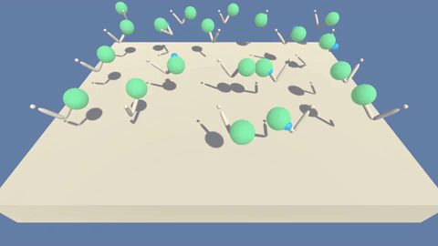

# Report

For viewing a video of a trained agent using this repository [click here.](https://vimeo.com/332195915)

## Learning Algorithm
I used a DDPG (Deep Deterministic Policy Gradient) learning algorithm for this project. Two networks architecture were used for this algorithm one as Critic and one as Actor. The Actor network will be the used policy that make the actions. The Critic network will be used to evaluate the value of state/actions. For each Actor and Critic network, two identical neural networks (identical in architecture) were used, one that does the learning and one set as target and soft update happens after a few time-steps of learning to make the target weights closer to the learning neural network. I used batch normalisation and added parallel learning to the agents for improved learning.

### Hyper parameters
* Replay Buffer Size = 100000
* Batch Size = 256
* Gamma (Discount factor) = 0.99
* Tau (Soft update parameter) = 0.001
* Learning Rate for Actor Network = 0.001
* Learning Rate for Critic Network = 0.001
* Update Every = 20
* Number of Updates = 10
* number of episodes = 3000
* Epsilon Start = 1.0
* Epsilon Decay Rate = 0.000001
* Weight Decay = 0
* Noise Sigma = 0.05

### Model Architecture
Actor:
`fc1 = [33, 256]`
`fc2 = [256, 256]`
`fc3 = [256, 4]`

Critic:
`fc1 = [33, 256]`
`fc2 = [256, 256]`
`fc3 = [256, 1]`

## Plot of Rewards
Agent solved the environment in episode 35! And highest score achieved with the agents was 39.08!

## Ideas for Future Work
* Implementing a Rainbow DQN.

* Experiment with more Actor-Critic algorithms like D4PG, A2C, AKTR etc.